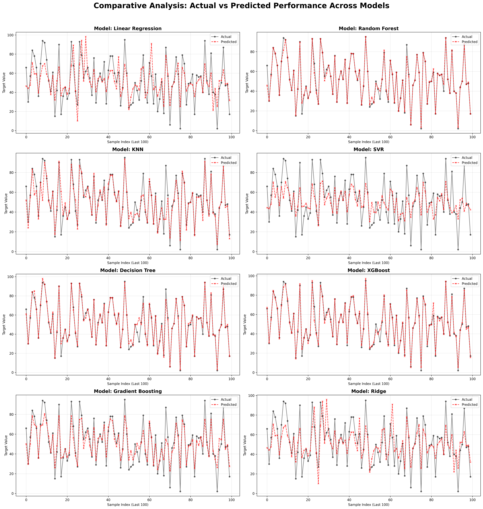
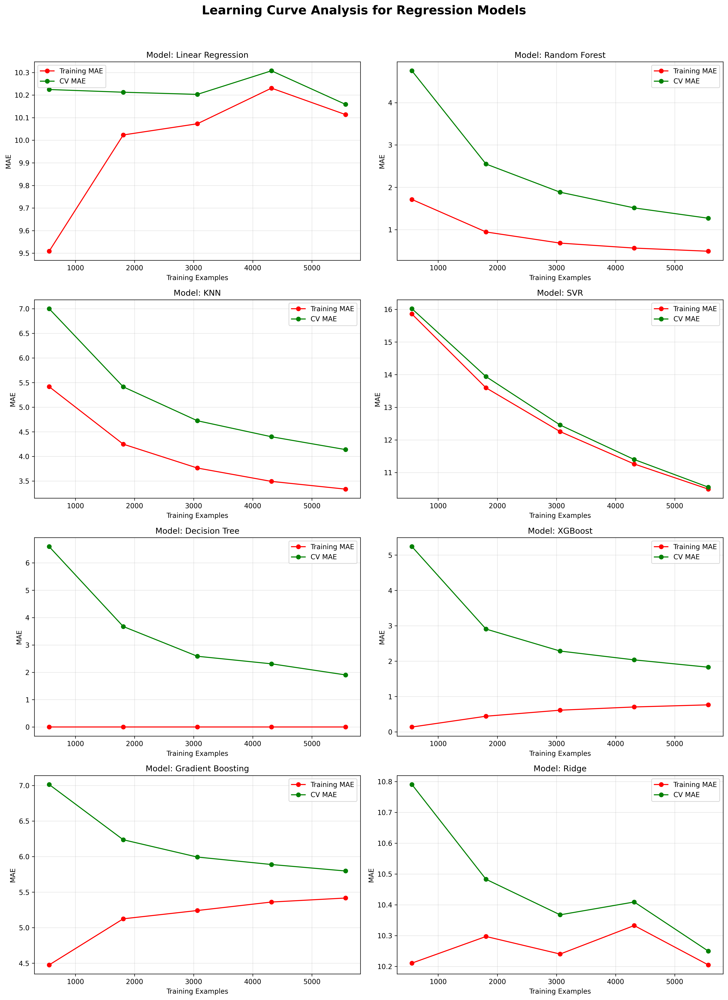
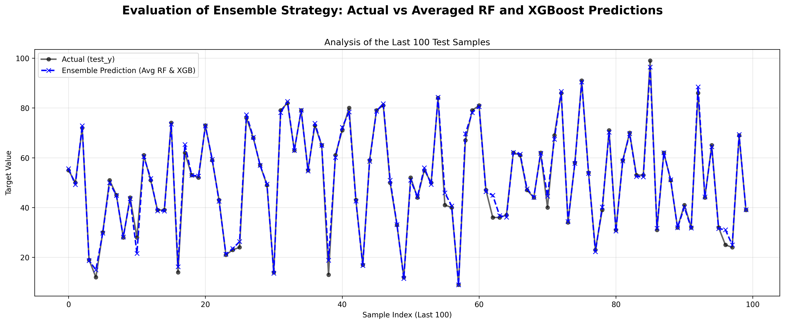

# Optimizing Ship Engine Health: Predicting Remaining Useful Life (RUL) using Ensemble Learning

## Summary
Unexpected failures in naval propulsion plants can lead to catastrophic operational halts and exorbitant emergency repair costs. This project develops a **Machine Learning-based Predictive Maintenance system** to estimate the Remaining Useful Life (RUL) of gas turbines and compressors. 

This project benchmarks 8 different regression models and ultimately implements an **Ensemble Averaging Strategy** (Random Forest + XGBoost). This approach effectively mitigates individual model biases, resulting in highly stable and accurate RUL predictions.

## Dataset & Target Engineering
The dataset is derived from a Naval Propulsion Plant simulation [[UCI](https://data.world/uci/condition-based-maintenance-of-naval-propulsion-plants)]. It contains various sensor readings including lever position, ship speed, shaft torque, temperatures, and pressures.

### Target Engineering: Formulating RUL
Because the dataset does not provide an explicit "time-to-failure" column, the target variable (RUL) was reverse-engineered using the physical degradation state coefficients of the Gas Turbine ($\kappa_T$) and Compressor ($\kappa_C$). 

The RUL percentage is calculated using the following normalization logic based on the minimum failure threshold:

$$RUL_{percentage} = \frac{\text{Current Coefficient} - \text{Min Threshold}}{1.00 - \text{Min Threshold}} \times 100$$

The final target variable is the average of the Compressor and Turbine RULs, providing a holistic **Global Engine Health (%)**.

## Data Preprocessing & Transformation
Real-world sensor data often suffers from skewness or discrete binning. To ensure optimal model performance, rigorous preprocessing was applied:

1.  **Feature Selection:** Dropped static/irrelevant features (`index`, `T1`, `P1`).
2.  **Handling Non-Normal Distributions (Jittering + Quantile Transform):**
    Many raw features exhibited heavily skewed or highly discrete distributions. To handle this, a `QuantileTransformer` (mapping to a normal distribution) was applied. For features with artificial discrete clustering, **Gaussian Jittering** (adding controlled random noise) was introduced prior to scaling.
3.  **Standardization:** Applied `StandardScaler` to ensure all numerical features were on the same scale.

**Visualizing the Transformation:**
*Top: Raw heavily skewed/discrete distributions. Bottom: Smoothed, normally distributed features ready for modeling.*

## Model Benchmarking
Eight different regression models were trained and evaluated. The dataset was split into 70% training and 30% testing.

| Model | MSE | MAE | RMSE |
| :--- | :--- | :--- | :--- |
| **Random Forest** | **6.14** | **1.00** | **2.47** |
| **XGBoost** | **7.07** | **1.59** | **2.65** |
| Decision Tree | 12.57 | 1.48 | 3.54 |
| KNN | 44.52 | 3.82 | 6.67 |
| Gradient Boosting | 61.87 | 5.84 | 7.86 |
| SVR | 160.23 | 9.33 | 12.65 |
| Linear Regression | 180.25 | 10.09 | 13.42 |
| Ridge | 180.52 | 10.16 | 13.43 |

**Actual vs Predicted Value Comparison Across All Models:**

## Model's Learning Curves
To ensure the top-performing models, which not only memorizing the data (overfitting), a Learning Curve analysis was conducted. 

As seen below, **Random Forest** and **XGBoost** show excellent convergence between training and cross-validation scores, indicating low bias and variance. In contrast, models like the Decision Tree showed severe overfitting (training MAE at 0 while validation remained high), and Linear models suffered from underfitting.

## Ensemble Averaging
To achieve the most robust prediction, the results of the top two performing models (Random Forest and XGBoost) were combined using a **Simple Averaging Ensemble strategy**. 

By averaging the predictions, the combined model smooths out individual peak errors from either algorithm, resulting in a highly reliable predictive curve that closely shadows the actual Ground Truth.

**Actual vs Ensemble Prediction (Averaged RF + XGB):**

## Early Warning System
By translating the continuous RUL percentage into actionable business logic, this model serves as the backbone for an automated Risk-Based Maintenance system:

* 🟢 **SAFE (RUL > 40%):** Continue normal operations.
* 🟡 **WARNING (20% ≤ RUL ≤ 40%):** Schedule maintenance and order spare parts (Cost-avoidance phase).
* 🔴 **CRITICAL (RUL < 20%):** Immediate engine shutdown required to prevent catastrophic failure.

## Tech Stack
* **Language:** Python
* **Data Manipulation:** Pandas, NumPy
* **Machine Learning:** Scikit-Learn, XGBoost
* **Visualization:** Matplotlib, Seaborn
